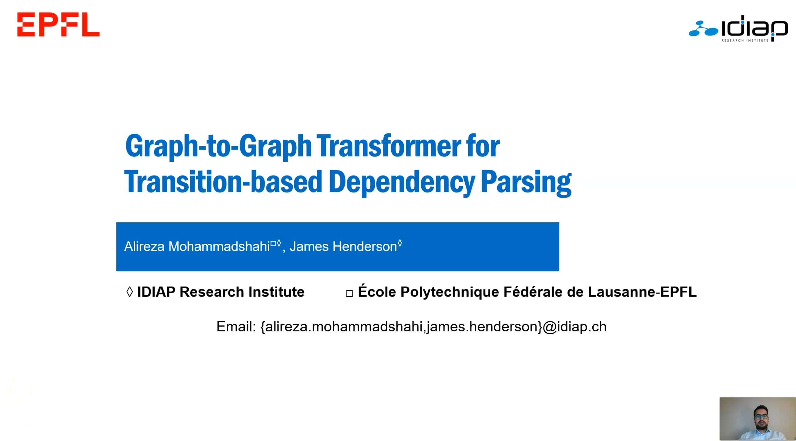
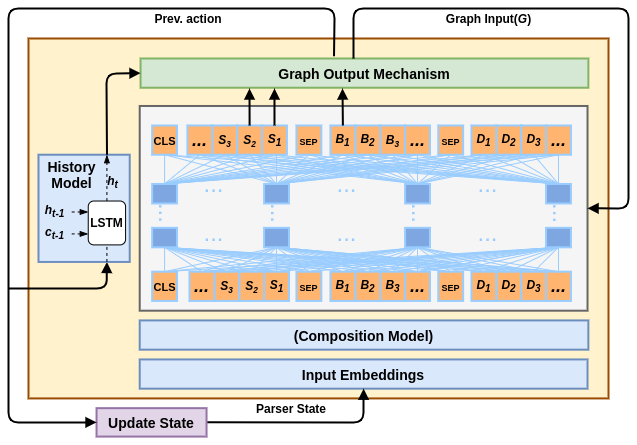

---
title: "Story of Graph-to-Graph Transformers"
permalink: /blog/
author_profile: true
redirect_from:
  - /blog
---


If you want to a **Transformer** model that additionally **input** or **output** **any graph structure**, and works with **BERT**, then you're on the right spot. In this blog, you will learn:  
- Encoding both graphs and sequences in one general Transformer
- Produce the required output graph
- Achieving state-of-the-art results on transition-based dependency parsing  

Lets get through our proposal which is accepted to Findings of EMNLP 2020 (will be presented at [4th Workshop on Structured Prediction for NLP](http://structuredprediction.github.io/SPNLP20)).

[](https://youtu.be/EAiJ1Z_qirk)

Introduction
-------------------------
We propose **Graph-to-Graph Transformer** architecture which combines the attention-based mechanism of [Transformer](https://arxiv.org/abs/1706.03762) for conditioning on graphs with an attention-like mechanism for predicting graphs. You can now encode both **sequences** and **graphs** in one general encoder as shown in Figure below.

<p align="center">
  
</p>


In our architecture, each attention head can easily learn to attend only to tokens in a given relation, but it can also learn other structures in combination with other inputs.  This gives a bias towards attention weights which respect locality in the input graph but does not hard-code any specific attention weights.  

We also demonstrate that, despite the modified input mechanisms, this Graph2Graph Transformer architecture can be effectively initialised with standard pre-trained Transformer models.  Initialising the Graph2Graph Transformer parser with pre-trained [BERT](https://www.aclweb.org/anthology/N19-1423/) parameters leads to substantial improvements. 

<p align="center">
  
</p>

In this paper, we apply our architecture to **transition-based dependency parsing** with arc-standard (plus SWAP operation for non-projective trees) system.  

Mathematical Description
-------------------------
Graph2Graph Transformer extends the architecture of the Transformer to accept any arbitrary graph as input. We add a second term to equations of Transformer, now value representations can be derived as: 

<p align="center">
 
</p>  

And attention weights can be calculated with a Softmax over:  

<p align="center">
 
</p> 

Where  is one-hot vector used to define the relationship between token  and . and  are  learned paramters. In this paper, we consider unlabelled dependency graph, so  could be *None*, *Left-rel*, or *Right-rel*. Here is one example of building matrix:  

<p align="center">
  
</p>

We've added dependency labels to corresponding embeddings of dependent words.  

The graph output mechanism of Graph2Graph Transformer predicts each labelled edge of the graph using the output embeddings of the tokens that are connected by that edge. In this work, the graph edges are labelled dependency relations, which are predicted as part of the actions of a transition-based dependency parser.  In particular, the Relation classifier uses the output embeddings of the top two elements on the stack and predicts the label of their dependency relation, conditioned on its direction.  There is also an Exist classifier, which uses the output embeddings of the top two elements on the stack and the front of the buffer to predict the type of parser action, *SHIFT*, *SWAP*, *RIGHT-ARC*, or *LEFT-ARC*.  

<p align="center">
 
</p> 
<p align="center">
 
</p> 

where , , and  are the output embeddings of top two tokens in the stack and the front of buffer, respectively.  The $\operatorname{Exist}$ and $\operatorname{Relation}$ classifiers are MLPs with one hidden layer.  

Applications
--------------------------
Our architecture can be easily applied to many NLP tasks which interact with different graphs. You just need to build  based on your graph structure. Here are potential applications:  
- NLP tasks which require to produce a graph such as syntactic parsing, semantic role labeling, and ...  

<p align="center">
  
</p>

- NLP tasks that use graph structure as an additional input to find better representations such as MT, NLI, and classification tasks.  

<p align="center">
  
</p>

Parsing Models
-------------------------
We define two Transformer-based models, called State and Sentence Transformers for transition-based dependency parsing, and integrate the Graph2Graph Transformer architecture with them. 

## State Transformer
We directly use the parser state, meaning both the stack and buffer elements, as the input to the Transformer model. We additionally incorporate components that have proved successful in [StackLSTM](https://arxiv.org/abs/1505.08075) paper.  

<p align="center">
  
</p>

The sequence of input tokens starts with the *CLS* symbol, then includes the tokens on the stack from bottom to top.  Then it has a *SEP* symbol, followed by the tokens on the buffer from front to back so that they are in the same order in which they appeared in the sentence. Given this input sequence, the model computes a sequence of vectors which are input to the Transformer network. Each vector is the sum of several embeddings, which are defined below.  

**Input Token Embeddings**: The embedding of each token is defined as:  

<p align="center">
 
</p> 

where  is pre-trained BERT embedding of first sub-word of each word, and we discard embeddings of non-first sub-words due to training efficiency.  is POS embedding which is initialised randomly.

**Composition Model**: As an alternative to our proposed graph input method, previous work has shown that complex phrases can be input to a neural network by using recursive neural networks to compose the embeddings of sub-phrases recursively. We extend the proposed composition model of \newcite{dyer-etal-2015-transition} by applying a one-layer feed-forward neural network as a composition model and adding skip connections to each recursive step. Here is one example of encoding partially constructed graph:  

<p align="center">
  
</p>

**Total Input Embeddings**: total embeddings of each token can be calculated as:  

<p align="center">
 
</p> 

where  is the output of composition model,  is position embedding, and  is segment embedding to distinguish tokens in stack and buffer.

**History Model**: We define a history model similar to [StackLSTM](https://arxiv.org/abs/1505.08075), to capture the information about previously specified transitions. The output $h^t$ of the history model is computed as follows:  

<p align="center">
 
</p> 

where  and  are the previous transition and its associated dependency label, and  and  are the previous output vector and cell state of the history model. The output of the history model is input directly to the parser action classifiers.

## Sentence Transformer

In this baseline, we directly input the initial sentence to Transformer, then we select the required output embeddings based on parser state. More specifically, the input sentence tokens are computed with the BERT tokeniser, and the next transition is predicted from the embeddings of the first sub-words of the top two elements of the stack and the front element of the buffer.  

<p align="center">
  
</p>

Total input embeddings are the summation of pre-trained token embeddings of BERT, randomised POS embeddings, and positional embeddings.

## Integrate Baselines with Graph2Graph Transformer

 We compute the new partially constructed graph in an auto-regressive manner as follows: 
 
<p align="center">
 
</p> 
<p align="center">
 
</p> 

where  is the current partially specified graph,  is the encoder's sequence of output token embeddings,  is the parser state, and  is the newly predicted partial graph. , and  are the graph input and graph output mechanisms. The  function selects from , the token embeddings of the top two elements on the stack and the front of the buffer, based on the parser state . 

We additionally add a third list to the input of State Transformer to keep track of words that have been deleted from the stack list. Also, we exclude the composition model from State Transformer when we integrate it with Graph2Graph Transformer.  

Results
---------------------------

We evaluate our models on English WSJ Penn Treebank and Universal Dependency Treebanks. To show the effectiveness of our model, we define a new variation of our model, which uses *CLS* embedding for prediction parser actions and labels instead of graph output mechanism. Here are detailed results:  

### WSJ Penn Treebank

For State Transformer, replacing the composition model (StateTr) with our graph input mechanism (StateTr+G2GTr) results in 9.97%,11.66% LAS relative error reduction (RER) without/with BERT initialisation, which demonstrates its effectiveness. Comparing to the closest previous model for conditioning of the parse graph, the StateTr+G2GTr model reaches better results than the StackLSTM model. Initialising our models with pre-trained BERT achieves 26.25% LAS RER for the StateTr model, and 27.64% LAS RER for the StateTr+G2GTr model, thus confirming the compatibility of our G2GTr architecture with pre-trained Transformer models. The BERT StateTr+G2GTr model outperforms previous state-of-the-art models.

<p align="center">
  
</p>

Removing the graph output mechanism (StateCLSTr, StateTr+G2CLSTr) results in a 12.28%,10.53% relative performance drop for the StateTr and StateTr+G2GTr models, respectively, which demonstrates the importance of our graph output mechanism.  
If we consider both the graph input and output mechanisms together, adding them both (BERT StateTr+G2GTr) to BERT StateCLSTr achieves 21.33% LAS relative error reduction, which shows the synergy of using both mechanisms together.
But then adding the composition model (BERT StateTr+G2GTr+C) results in an 8.84% relative drop in performance, which demonstrates again that our proposed graph input method is a more effective way to model the partial parse than recursive composition models. 

For Sentence Transformer, the synergy between its encoder and BERT results in excellent performance even for the baseline model. Nonetheless, adding G2GTr achieves significant improvement (4.62% LAS RER), which again demonstrates the effectiveness of the Graph2Graph Transformer architecture.  
Finally, we also evaluate the BERT SentTr+G2GTr model with seven self-attention layers instead of 6, resulting in 2.19% LAS RER, which motivates future work on larger Graph2Graph Transformer models.


### UD Treebanks

 We compare our BERT SentTr+G2GTr model with previous work based on LAS. As the baseline, we use scores of the transition-based model proposed by [Kulmizev et al,2019](https://arxiv.org/abs/1908.07397), which uses the deep contextualised word representations of BERT and ELMo as an additional input to their parsing models. The BERT SentTr+G2GTr model performs substantially better than the baseline on all languages, which confirms the effectiveness of our Graph2Graph Transformer architecture to capture a diversity of types of structure from a variety of corpus sizes.


Error Analysis
----------------------------
To analyse the effectiveness of the proposed graph input and output mechanisms in variations of our StateTr model pre-trained with BERT, we measure their accuracy as a function of dependency length, distance to root, sentence length, and dependency type. Results show that most of the improvement of the StateTr+G2GTr model over other variations comes from the hard cases which require a more global view of the sentence. 

 **Dependency Length**: The integrated G2GTr models outperform other models on the longer (more difficult) dependencies, which demonstrates the benefit of adding the partial dependency tree to the self-attention model, which provides a global view of the sentence when the model considers long dependencies. Excluding the graph output mechanism also results in a drop in performance, particularly in long dependencies.

 **Distance to Root**: The StateTr+G2GTr models outperform baseline models on nodes that are of middle depths, which tend to be neither near the root nor near the leaves, and thus require more global information, as well as deeper nodes.

**Sentence Length**: The relative stability of the StateTr+G2GTr model across different sentence lengths again shows the effectiveness of the  Graph2Graph Transformer model on the harder cases. Not using the graph output method shows particularly bad performance on long sentences, as does keeping the composition model.

  
  
Implementation
---------------------------
You can find the implementation of our proposal for transition-based dependency parsing on [G2GTr](https://github.com/alirezamshi/G2GTr) repository. In order to use Graph2Graph Transformer for your NLP task, you should refer to [g2g-transformer](https://github.com/idiap/g2g-transformer) repository. Here is a sample usage:


```python
#Loading BertGraphModel and initialize it with available BERT models.
import torch
from parser.utils.graph import initialize_bertgraph,BertGraphModel
# inputing unlabelled graph with label size 5, and Layer Normalization of key
# you can load other BERT pre-trained models too.
encoder = initialize_bertgraph('bert-base-cased',layernorm_key=True,layernorm_value=False,
             input_label_graph=False,input_unlabel_graph=True,label_size=5)

#sample input
input = torch.tensor([[1,2],[3,4]])
graph = torch.tensor([ [[1,0],[0,1]],[[0,1],[1,0]] ])
graph_rel = torch.tensor([[0,1],[3,4]])
output = encoder(input_ids=input,graph_arc=graph,graph_rel=graph_rel)
print(output[0].shape)
## torch.Size([2, 2, 768])

# inputting labelled graph
encoder = initialize_bertgraph('bert-base-cased',layernorm_key=True,layernorm_value=False,
             input_label_graph=True,input_unlabel_graph=False,label_size=5)

#sample input
input = torch.tensor([[1,2],[3,4]])
graph = torch.tensor([ [[2,0],[0,3]],[[0,1],[4,0]] ])
output = encoder(input_ids=input,graph_arc=graph,)
print(output[0].shape)
## torch.Size([2, 2, 768])
```
If you just want to use `BertGraphModel` in your research, you can just import it
from our repository:
```python
from parser.utils.graph import BertGraphModel,BertGraphConfig
config = BertGraphConfig(YOUR-CONFIG)
config.add_graph_par(GRAPH-CONFIG)
encoder = BertGraphModel(config)
```

Related Work
---------------------------
The following paper is a recursive non-autoregressive version of G2G Transformer which is used to refine graphs:  
- ["Recursive Non-Autoregressive Graph-to-Graph Transformer for Dependency Parsing with Iterative Refinement"]({{ site.url }}/publications), accepted to TACL journal.


Share: <a href="https://twitter.com/share?ref_src=twsrc%5Etfw" class="twitter-share-button" data-text="Graph-to-Graph Transformers: Post on EMNLP 2020 paper!" data-url="https://alirezamshi.github.io/blog/" data-lang="en" data-show-count="false">Tweet</a><script async src="https://platform.twitter.com/widgets.js" charset="utf-8"></script> 
